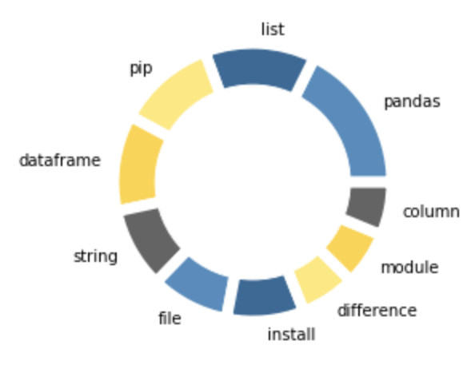
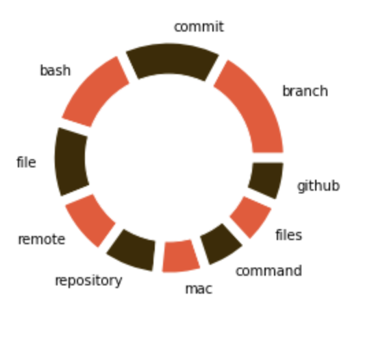
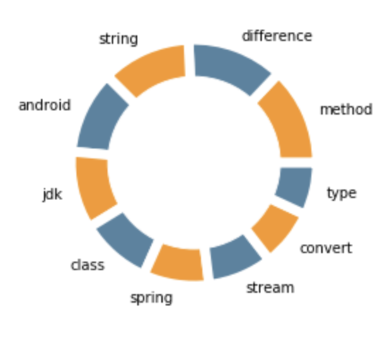

# Social graphs and interactions 2019 - A Stack Overflow Study

## Central idea

As a software engineer stackoverflow is used regularly, over not just a students lifetime at DTU, but also through a career. Therefore we thought it would be interesting to look into which questions or problems other people in the same situation deals with. The idea behind the project is to study stackoverflow's top questions over the last 10 years, to recognize the evolution of programming and identify which problems relates to which languages. We also look into which words are important to some programming languages/topics. Furthermore we create a network of programming languages and detect communities within the network.

## Dataset

The dataset is pulled from the StackExchange API (https://api.stackexchange.com/). It consists of the top 100 questions every month, based on score in descending order for the described timeframe. The API only allows for pulling 100 questions at a time, which is why we pull for every month. This is done for the last 10 years, resulting in 1200 questions a year and a total of 12000 questions. The data is stored as a json object where the values from the tags, score, title and body keys is used for further processing. The body contains answers to the question. The dataset is around 30 mb in total. 

## Analysis of network and text

### Text analysis
#### Examining code languages and topics on stack overflow

Are there even any differences from one code language to another? Don't they just discuss the same things and have the same problems? There are certainly differences, and the discussions and problems seems to be quite specific within each topic. A topic corresponds to what is used as a tag on Stack Overflow, and therefore a coding language. To show exactly how the topics differs from each other, we have used two tools for visualisation for a select number of tags. The first one is wheel of words characterizing the most common solved problems within each language. These are generated from the words of the question titles themselves, where the question resembles a direct problem and the words are shown based on how many times that word was used within a question for that language. The second thing on display are wordclouds. These are generated based on TF-IDF analysis on the bodies of a question, to showcase specific unique words that really characterizes and play an important role for that language. Each question have some number of answers, and these have been used in unison to characterize the tag/topic/code language. Maybe you can guess what tag is described?

  

  

  

  

  

If it was too hard to guess, heres the order of display: Javascprit, Python, Git, Android, Java. These are select tags, based on them having the overall highest scores as we will see in the next part because they remain relevant and have been remaining relevant for the last many years.

### Score

#### Tags with highest sum of scores
One might wonder, if the code language taught to you have any relevancy to other people as well. A tag with a very high score, hints that lots of people have problems within this topic, meaning a measure of relevancy, and that they could also receive help with their problem, meaning that someone actually knows how to solve the frequent problems. Maybe its a code language that is very common, and beginners often find themselves having one certain problem. That could indicate a weakness in the language, but a strength in this forum community on Stack Overflow, as a question with high score also indicates it has good answers.

Lets take a look on the sum of score for the last 10 years, using top 100 scoring questions each month. 

Javascript is apparantly the topic that is hottest, so to speak. Out of the most relevant questions, javascript seem to dominate as the language having the most frequent problems with a good solution. Further down we see datastructures and other tags. The plot is an overall picture, meaning this might not give a good picture for relevancy or "hotness" of a topic at this point in time. The computing world is in constant change! So lets try to see what happens over time.

#### Tag score over time
When dealing with something like code languages, something might quite quickly gain a lot of traffic while other languages burn out. Unless of course the language is something like Java which incredibly many trading systems (like banks) use. 

Going back in time the scores are higher, due to more and more years of accumulating score. Javascript is the tag/language with highest score most often, which correlates with it being the tag with highest score overall aswell. 

The bar plot indicates that some tags or topics haven't just gone out of fashion for the last 10 years. One being Javascript, present in the top 5 every year. However, Git has way higher sum of scores earlier years. Git isn't changing very much, its not as dynamic as other code languages can be. That means, that the same questions posted 10 years ago, can be as relevant now as then. The old questions accumulate higher and higher score when this is the case. As a sidenote to this, repetitions of questions are generally removed on Stack Overflow.

### Network

#### Popular tags

First we wish to find the most popular subjects on Stack Overflow. We do this by taking each questions tags and grouping them together. Here we count the number of occurences and we find the following results:

There is a very clear top 4, and an even more clear winner; Javascript. Javascript appears approximately 1400 times in the 12000, meaning 12\% of all questions are about Javascript.
Interestingly android has twice the number of tags of ios, finally settling the debate about which is the most popular mobile operating system. However, this is more likely due to android being easier accessible to new programmers.

But how have these subjects popularity developed over time? We investigate the 6 most popular tags of all time, and see their development through the last 10 years.

As can be seen from the bar plot, most of the tags fluctuate quite a bit. Especially c++ which tripples its amount of occurences in 2019. C++ has seen a resurgance the last few years1, but unfortunately nothing explains a development this wild. This is likely due to a random outlier in our data, even if we have 3600 tags from 2019.

We also se python increase in popularity, this correlates well with the trend seen in larger datasets and analyses1.

Just to show that our data does infact portray the real world we show you reactjs' development throught the last 10 years.

As you may have guessed from the bar plot, reactjs was launched in 2013 by Facebook and has since quickly gained a lot of popularity.

#### Network of tags

Each question has one or more tags, where you can tag more subjects if your questions has correlation to more than one subject. We want to see which tags are well connected and which groups of tags may appear.

With Force Atlas 2 we visualize a network labeling the 25 tags with highest degree.

This beautiful network clearly shows how a few nodes have a strong pull with some clear connections to other nodes, which we will now explore.

Below we have highlighted the areas that we find interesting are grouped together.

There are some clear correlations between certain tag groups, for example the group at the top of the network. This group contains angular, css, html and jquery. All are highly related to frontend and web development.

Meanwhile a group of swift, ios, macos, xcode and linux have assembled on the right side. It seems Apple is such an important player in the world, that even our Stack Overflow network is affected by a single company. Linux has has snuck in there most as macos are both operating systems, and very similar to each other when compared to an OS like Microsoft.

Performance computing has a group at the bottom with C, C++, string and performance. C++ and C are often used for high performance computing (HPC), but string has most likely to do with strings in C and C++ being problematic to most newcommers of the languages.

Stack Overflow has done some analysis themselves, and it might be interesting to compare our results.

We can see that their network has clear similarities to our network. The same groups of (swift, ios, macos, xcode and linux), (angular, css, html and jquery) and (android, java) occur in their network. Quite interesting that we can see the same results from an 10 year perspective, that they may see from 2019. This suggest that the software world is very structured and consistent when it comes to relations between programming subjects.

#### Degree distribution

Let's take a look at the connections between the nodes.

It's very clear that most subject are only connected to approximately 5 or 6 other subjects. This could indicate that subjects on Stack Overflow are very secluded, and question are generally very specific. However it could also mean that a lot of programming subject do not share very many of the same problems. A language like C which has troublesome Strings (atleast for new programmers), does not share string issues with Java - a language which has simple String objects.

## Download dataset

All data used in the making of this webpage can be downloadet by clicking the following link.
[Dataset download link](https://github.com/MadsVSChristensen/socialgraphs-project/raw/master/stackoverflow-data.zip 'Data set')

## Explainer notebook

[Link to explainer notebook](https://nbviewer.jupyter.org/github/MadsVSChristensen/socialgraphs-project/blob/master/Project-assignment.ipynb 'Explainer notebook')

## References

1. https://www.tiobe.com/tiobe-index/
